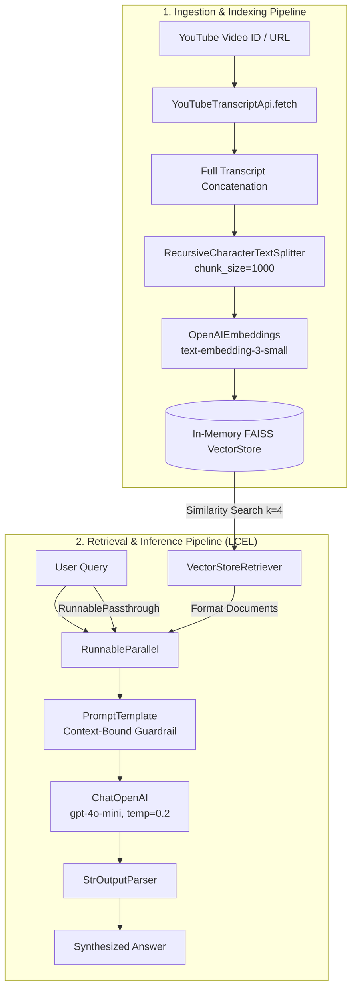

# YouTube Transcript RAG Pipeline 🎥 ⚡

[](https://www.python.org/downloads/)
[](https://python.langchain.com/)
[](https://github.com/facebookresearch/faiss)
[](https://openai.com/)
[](https://github.com/astral-sh/uv)

A production-grade, in-memory Retrieval-Augmented Generation (RAG) pipeline that allows users to perform grounded question-answering over YouTube video transcripts with zero hallucination leakage. Built with declarative **LangChain Expression Language (LCEL)**, **FAISS**, and **OpenAI**.

---

## 📌 Executive Summary

Processing lengthy video content is time-consuming and computationally expensive. This system extracts transcripts from YouTube videos on-demand, generates dense semantic vector representations, constructs an ephemeral FAISS vector index, and orchestrates an LCEL-driven retrieval pipeline with strict context bounding.

### Key Architectural Strengths

- **Strict Grounding & Hallucination Guardrails:** The generation prompt explicitly instructs the LLM to answer *exclusively* from retrieved chunks and fall back to `"Insufficient context"` when information is absent.
- **Dynamic In-Memory Indexing:** Switch targets on the fly via the `set video` command without restarting the runtime or managing external database infrastructure.
- **Declarative Composition:** Leverages `RunnableParallel`, `RunnablePassthrough`, and `RunnableLambda` for transparent data flow and minimal glue code.
- **Modern Packaging:** Configured with `pyproject.toml` and lockfile-backed dependency management via `uv`.

---

## 🏗️ Architecture & Data Flow



---

## 📂 Repository Structure

```
YoutubeRAG/
├── main.py              # Interactive CLI REPL with dynamic video switching & parsing
├── yt_rag.py            # Core RAG engine: ingestion, vectorization, and LCEL chain
├── pyproject.toml       # Project metadata, configuration, and dependencies
├── uv.lock              # Deterministic dependency lockfile
├── .env.example         # Template for required environment variables
└── README.md            # Technical documentation and operational runbook
```

---

## ⚙️ Prerequisites

- **Python**: `>= 3.13`
- **Package Manager**: [`uv`](https://github.com/astral-sh/uv) (recommended) or `pip`
- **API Keys**: Valid OpenAI API Key with access to `gpt-4o-mini` and `text-embedding-3-small`

---

## 🚀 Quickstart

### 1. Clone & Navigate to Project

```bash
git clone <repo-url>
cd YoutubeRAG
```

### 2. Configure Environment

Create your `.env` file from the provided template:

```bash
cp .env.example .env
```

Add your OpenAI API key to `.env`:

```env
OPENAI_API_KEY=sk-...
```

### 3. Install Dependencies

Using **uv** (recommended):

```bash
uv sync
```

Alternatively, using standard **pip**:

```bash
python3 -m venv .venv
source .venv/bin/activate
pip install -e .
```

### 4. Run the CLI Assistant

```bash
# Using uv
uv run python main.py

# Or directly in an active virtual environment
python main.py
```

---

## 💻 CLI Commands & Usage

The application starts an interactive REPL with a default pre-loaded video (`NYFGCESmikA` - *Lenin Quote / Historical Context*).

### Command Reference

| Command | Syntax | Description |
| :--- | :--- | :--- |
| **Set Video** | `set video <video_id>` | Replaces current transcript and builds a new FAISS vector index. Accepts raw IDs or full YouTube URLs. |
| **Set Video (Prompt)** | `set video` | Prompts interactively for the video ID or URL. |
| **Query** | `<question>` | Performs similarity search against indexed chunks and streams response. |
| **Exit** | `quit` or `exit` | Gracefully terminates the REPL session. |

### Example Session Walkthrough

```text
============================================================
 YouTube Transcript RAG Assistant
 Commands:
   set video <id or URL> : Index a new YouTube video
   quit / exit          : Exit the program
============================================================
Loading initial video (NYFGCESmikA)...
Ready for questions!

ask a question > what was the main idea discussed?
The main idea discussed is that there are decades where nothing happens, 
and weeks where decades happen, highlighting periods of rapid change.

ask a question > set video https://www.youtube.com/watch?v=dQw4w9WgXcQ
Indexing video 'dQw4w9WgXcQ'...
Video 'dQw4w9WgXcQ' is ready.

ask a question > what promises are made in the video?
The speaker promises never to give you up, never to let you down, 
never to run around and desert you.

ask a question > quit
Exiting. Goodbye!
```

---

## 🔧 Technical Details & Hyperparameters

| Component | Choice | Rationale |
| :--- | :--- | :--- |
| **LLM** | `gpt-4o-mini` (`temperature=0.2`) | Cost-effective, high instruction-following adherence, deterministic output. |
| **Embeddings** | `text-embedding-3-small` | 1536-dimensional dense vectors; optimal latency vs. accuracy profile. |
| **Chunking** | `RecursiveCharacterTextSplitter(chunk_size=1000)` | Aligns with natural paragraph/sentence boundaries in speech transcripts. |
| **Vector Store** | `FAISS (faiss-cpu)` | Microsecond latency in-memory search with zero external infra dependencies. |
| **Retriever Strategy** | `search_type="similarity"`, `k=4` | Retrieves top 4 most relevant 1000-character segments (~4000 chars context window). |

---

## 📈 Staff Engineering Roadmap & Production Considerations

For enterprise / multi-tenant production readiness, the following enhancements are recommended:

- [ ] **Persistent Vector Caching**: Transition from transient in-memory FAISS to a persistent cache (e.g., PostgreSQL with `pgvector`, Qdrant, or Pinecone), keyed by SHA-256 hash of the `video_id`, preventing redundant OpenAI embedding compute across queries.
- [ ] **Audio Fallback via Whisper**: For videos with disabled or auto-translated transcripts, integrate `yt-dlp` audio extraction piped to OpenAI `whisper-1` or local Whisper.
- [ ] **Hybrid Search (BM25 + Dense Vectors)**: Implement an ensemble retriever with Reciprocal Rank Fusion (RRF) to capture exact keyword matches (e.g., specific terms, names, timestamps) alongside semantic intent.
- [ ] **Streaming Responses (TTFT Optimization)**: Replace synchronous `.invoke()` with asynchronous `.astream()` to deliver real-time token streaming to the user interface.
- [ ] **Observability & Tracing**: Integrate LangSmith or OpenTelemetry hooks to track token consumption, latency breakdown, and retrieval precision/recall metrics.
